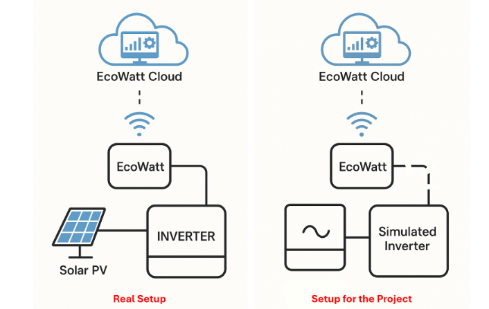

# EcoWatt for Solar inverters

Ecowatt is an embedded system that is connected to solar inverters to read parameters from them and send the data to the cloud. This demo uses an online InverterSIM as the solar inverter.

The following is the architecture of the project.



There are three components of this project,
1. Online inverterSIM - which is configured using API
2. EcoWatt device - NodeMCU
3. EcoWatt cloud - cloud configuration for the device

This project consists of 4 main milestones.

## Milestone 1

In Milestone 1, we built a PetriNet diagram to identify the architecture of the EcoWatt device and how it works. Then based on that diagram, a scaffold code is created to simulate the functionality of the device. Following are the Petrinet diagram and the demo video of the scaffold code.

[PeteriNet diagram](https://drive.google.com/file/d/15ALogLgaHMUhQ6W8kmQFQu1SFCyAevvc/view?usp=drive_link)
[Demo video](https://drive.google.com/file/d/1hROSwhe20sWfY8Vbdq4S5FbaViUpt6ox/view) 

To see how it works, follow the following commands

```bash
# clone the repository
git clone git@github.com:AnushkaSamaranayake/EcoWatt.git

# Go to the folder
cd Milestone_1

# Run the Python file
python main.py

```

## Milestone 2

In Milestone 2, we create a protocol adapter to connect via http API to the online InverterSIM. There we use Modbus RTU communication to communicate with the online InverterSIM.

In the protocol adapter,
1. First, we build a Modbus request frame and send it through the `/read` API
2. Then we decode the received response and check the CRC validation
3. Then we store the values in the buffer
4. Also, we can write to the InverterSIM through the `/write` API

Then we have a data acquisition scheduler which polls the InverterSIM every 5 seconds

In this milestone, we used the Platform.io extension in VSCode and we used a NodeMCU (ESP8266) as the device to the demonstration.

Since you have already cloned the repository,

```bash
# Connect the Node MCU

# Go to the Milestone_2
cd Milestone_2

#upload the code to the NodeMCU and run
```

Now you can see the outputs from the serial monitor of the NodeMCU.

Following is the demo video and the protocol documentation

[Demo video](https://drive.google.com/file/d/1DyZgW_ta5l4TNoQSV3jk2fRqGFYG0y4W/view?usp=drive_link)
[Protocol Documentation](https://drive.google.com/file/d/13PiZtXgCqF5jm97-vKCKLQgPyyPpnMID/view?usp=drive_link)

## Milestone 3

In Milestone 3, the Ecowatt device will send the data to the cloud server. Before sending data to the cloud, it will first be buffered and will be compressed using the DELTA-RTL compression algorithm, and the uplink packetizer will send the data to the cloud every 15-minute cycle via an HTTP request.


1. To run the project, first connect your computer and the ESP to the same WIFI router (to create a LAN). The SSID and the Password should be updated with your WIFI credentials. Then upload the code to the Node MCU.
   ```bash
   # Go to the folder
   cd Milestone_3

   # Code for the device 
   cd ecowatt-device
   
3. Install Node-RED, and after installing it, open Node-RED by typing the following command in the terminal. Now you can open Node-RED by using the URL <your-wifi-ip>:1880 
   ```bash
   node-red
   ```
   
4. After opening Node-RED, go to the folder ecowatt-nodered
   ```bash
   cd ecowatt-nodered
   ```
   
5. Import the flows.json file in the ecowatt-nodered folder in the device to the red and deploy it.

6. Now create a .env file including the API tokens for the devices. 

7. Now run the api-service.py to run the API service. It will be run on <your-wifi-api>:5000 The API service will forward the packets coming from the Eco Watt device to the cloud.
   ```bash
   python api-service.py
   ```
8. Now you can connect the ESP Node MCU to the computer and then you can see the updated Node-RED Dashboard.

** Note: when the wifi router is changed, always check the IP address and do the relevent changes.
